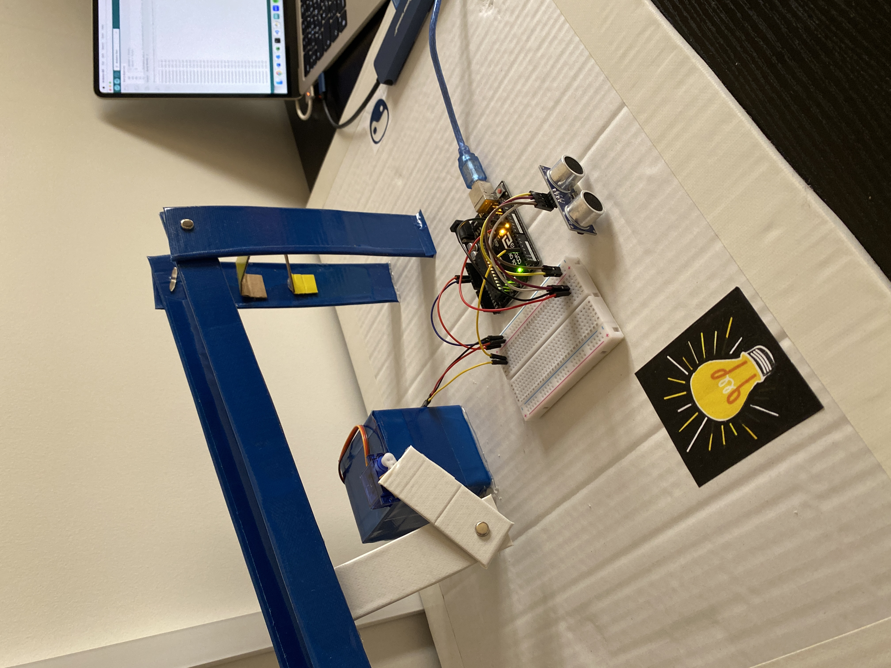

# Ball & Beam :tennis:

## Aim

The aim of the game is to balance the ball on the beam by adjusting the distance between your hand and the sensor.

## How it works 

As the distance between my hand and the sensor decreases, the angle at which the servo moves increases from its initial position and vice versa. The distance between my hand and the sensor is displayed on the serial monitor in the bottom right of the video.

To build this project, I primarily used an Arduino Uno, ultrasonic sensor and servo motor.

## Visuals

[Ball and Beam In Action](https://www.youtube.com/watch?v=xNa3PSpyW1o)

